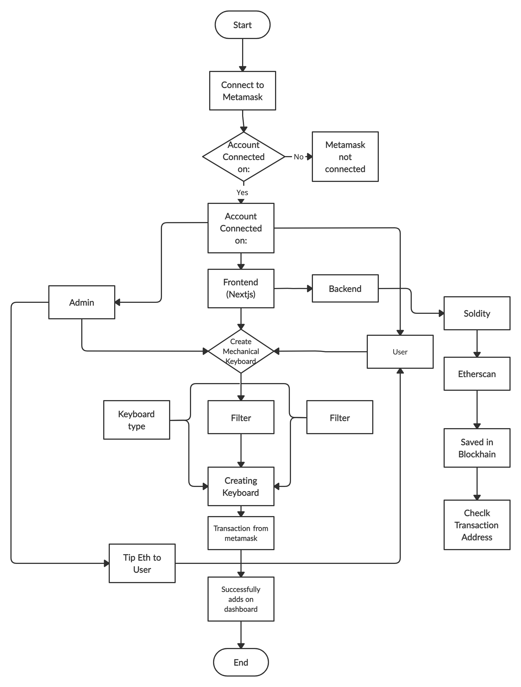

# Keyboard Generator DAPP

A decentralized web app that will allow you to create an on-chain mechanical keyboard, view other users' keyboards, and send an ETH tip to your favorites!

## Install dependencies

Run the following command inside the project repo to install dependencies

```yarn```

For npm

```npm install```

## .env setup

Create .env file and copy the code from .env.sample or from below:

export NODE_API_URL=<ALCHEMY_SEPOLIA_NODE_API_URL>
export SEPOLIA_PRIVATE_KEY=<METAMASK_PRIVATE_KEY>

## Start the project

Run the following command to start the next.js server

```yarn dev```

For npm

```npm run dev```

## Hardhat Helpers
Try running some of the following tasks:

```shell
npx hardhat help
npx hardhat test
REPORT_GAS=true npx hardhat test
npx hardhat node
npx hardhat run scripts/deploy.js
```

## Flowchart



## Connecting a MetaMask wallet

To connect MetaMask wallet with the dapp so that we can use it to fetch data and make transactions to our contract! This is kind of like logging in to our app!

We have 3 different returns:
- If ethereum is missing then our app can’t do much, so we ask the user to install MetaMask so they can log in and use it!
- If there’s no connected account then we render a connect button. We’ll make this work soon!
- If there is a connected account then we show it!

SS

If you reload the app again, click the button and authorize a MetaMask account, then you should get the 3rd state showing we’re connected! BTW make sure your MetaMask is on Sepolia at this point, that’ll be essential when we connect to our contract!

SS

We’ve connected an Ethereum address to our site! Web3 makes logging in super easy, and it works the same on every site.

Here’s how things should look:

SS

## Create Keyboard

This is super easy! We already have a <Keyboard> component and state holding our current form values. We just need to add a preview after the form. In pages/create.js:

Now we can see a render of the keyboard that we’ve selected before we save it!

SS

## Tip

We’re going to update our Keyboard struct to store the address of the person who created it. This will allow us to tip that person!

SS

This function is marked as payable. That means that when we call it, we can send it Ethereum! This is really cool because the contract can do whatever it wants with the money sent to it! It can just hold onto it if it wants to, a contract has its own balance.

## Live Notifications

The basic pattern is that our contract emits (sends) events, and our web app can listen for them and take action when any user tip to awesome keyboard!

SS
